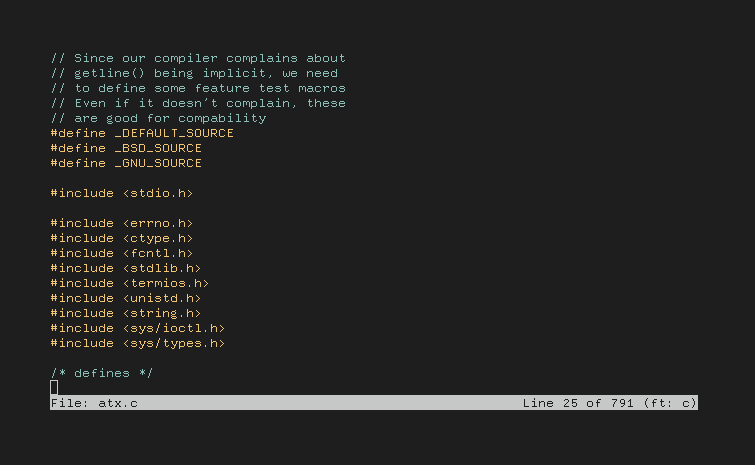
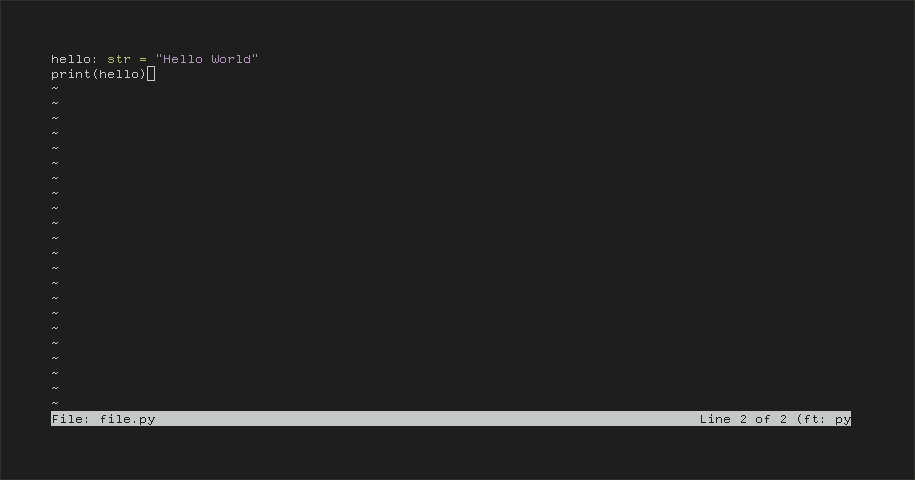

<p align="center"></p>
abxxbo's text editor

## Checklist

### Main
- [X] Save to file
- [X] Read file
- [X] Syntax highlighting
- [X] Search for keyword
- [ ] Line numbers

## Other
- [ ] Config file for ATX
- [ ] Plugin system
- [ ] More syntax highlighting (desired: Make and Markdown)

# Screencast


# Screenshots

<p><em>ATX editing a C file with C style syntax highlighting</em></p>
<br>
<br>


<p><em>ATX editing a Python file with Python syntax highlighting</em></p>

## Dependencies
- make
- Any C compiler

## Compilation
```sh
# Compile atx
$ make
```

# Milestones
This is a list of all milestones that have been accomplished.

- [9a96e38 - read full file](https://github.com/abxxbo/atx/commit/9a96e38c33c19fe38f69ea7c1d6b289886c643c4)
- [c62184f - status bar](https://github.com/abxxbo/atx/commit/c62184f978dc3566cfc4189cb7242492905c3a3d)
- [9e069fc - write to a file](https://github.com/abxxbo/atx/commit/9e069fc73c8675074e67a6a5cc70267778939dca)

# Is this a good replacement for X?
Depends on the editor

## Vim / Neovim
No.

## GNU Nano
In my opinion, yes.

## Emacs
No.

## Other editors
I am not listing every single editor, so this is up to you.
